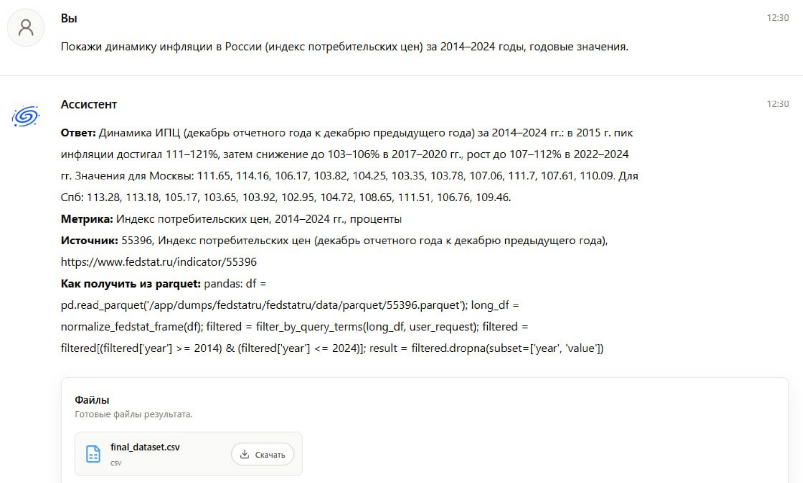
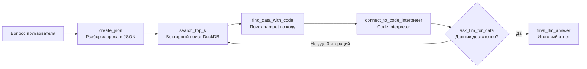

<div align="center">

# 📊 AI-ассистент для экономистов

**LLM-помощник, который отвечает на вопросы по официальной статистике ЕМИСС (Fedstat) и опирается только на найденные данные, а не на «память» модели.**


</div>

---

## 🎯 Проблема

Аналитики тратят часы на поиск нужного показателя среди тысяч таблиц Fedstat и ручную выгрузку цифр. Обычные чат-боты «галлюцинируют»: выдают правдоподобные, но неверные числа.

## 💡 Решение

Система превращает вопрос на естественном языке в ответ, подкреплённый реальными данными:

1. **Понимает запрос.** LLM разбирает вопрос в структурированный JSON (тип поиска, ключевые слова, фильтры). Формат ответа модели проверяется отдельным скриптом.
2. **Находит показатель.** Семантический поиск по эмбеддингам в DuckDB (cosine similarity).
3. **Достаёт цифры.** Code Interpreter загружает нужный `.parquet`, и LLM сама пишет код для извлечения значений.
4. **Проверяет полноту.** Если данных не хватает, формулируется новый поисковый запрос и цикл повторяется (до 3 итераций).
5. **Отвечает строго по данным.** Финальный ответ строится только на собранных фактах.

## 🎬 Демо



Пример другого готового выходного файла по запросу данных инфляции с 2014 по 2024 год: [`data/inflation_russia_2014_2024.csv`](data/inflation_russia_2014_2024.csv).

## 🏗 Архитектура



## 🛠 Технологии и навыки

| Область | Что использовано |
|---|---|
| **LLM / RAG** | Yandex Cloud LLM, prompt engineering, структурированный вывод (JSON), итеративный добор контекста |
| **Поиск** | Embeddings, cosine similarity, векторный поиск в DuckDB |
| **Данные** | DuckDB, Parquet, pandas, подготовка и очистка датасетов Fedstat |
| **Агентный подход** | Code Interpreter: LLM генерирует и выполняет код для анализа таблиц |
| **Качество** | Проверка JSON-ответов модели на соответствие заданному формату |
| **Инженерия** | Python, модульная архитектура, централизованная конфигурация, `.env` |

## 📁 Структура проекта

```
├── main.py                         # Точка входа: запрос → поиск → добор → ответ
├── config.py                       # Переменные окружения, пути к данным, параметры
├── create_json.py                  # Запрос → структурированный JSON
├── search_top_k.py                 # Векторный поиск по таблице fedstatru
├── find_data_with_code.py          # Определение parquet по коду показателя
├── connect_to_code_interpreter.py  # Извлечение данных через Code Interpreter
├── ask_llm_for_data.py             # Проверка полноты данных, новый поисковый запрос
├── final_llm_answer.py             # Итоговый ответ по собранным данным
├── load_to_duckdb.py               # Сборка базы эмбеддингов из CSV
├── clean_dataset.py                # Подготовка данных
├── checking_full_json.py           # Проверка формата JSON-ответов модели
├── data/                           # Метаданные показателей, БД, пример выходного файла
└── screenshots/                    # Скриншоты
```

## Быстрый старт

**1. Установка**
```bash
git clone https://github.com/dimagordienko/<repo-name>.git
cd <repo-name>
python -m venv venv
source venv/bin/activate        # Windows: .\venv\Scripts\Activate.ps1
pip install -r requirements.txt
```

**2. Настройка окружения**
```bash
cp .env.example .env
```
Заполните в `.env`: `YANDEX_CLOUD_FOLDER`, `YANDEX_CLOUD_API_KEY`, `YANDEX_CLOUD_MODEL`.
Пути к данным и остальные параметры задаются в `config.py`.

**3. Данные**

Поместите parquet-файлы Fedstat в `dumps/fedstatru/fedstatru/data/parquet/` (структура папок должна совпадать с исходной выгрузкой).

Готовая `data/my_db.duckdb` уже в репозитории. Чтобы пересобрать её из CSV:
```bash
python load_to_duckdb.py
```

**4. Запуск**
```bash
python main.py
```

**5. Проверка формата JSON-ответов модели** (необязательно)
```bash
python checking_full_json.py
```

## Ограничения и планы развития

Текущая версия — рабочий прототип:

- [ ] Поиск использует `top_k=1`. Планируется ранжирование нескольких кандидатов (re-ranking).
- [ ] Гибридный поиск (keyword + vector): режим заложен в JSON-схеме, но пока не используется.
- [ ] Ускорение: один вызов API занимает 30-60 сек, нужны кэширование и параллельные запросы.
- [ ] Расширенный набор тестовых вопросов и автоматическая оценка точности ответов.
- [ ] Веб-интерфейс (Streamlit / Gradio).